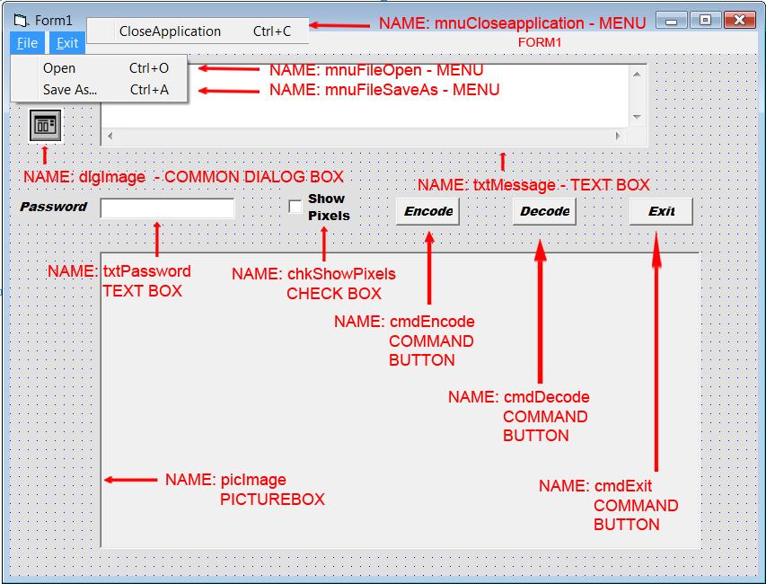

Steganography
==================================================================

INTRODUCTION
--------------------------------------

Steganography is the art or practice of concealing a file, message, image, or video within another file, message, image, or video. The word steganography combines the Ancient Greek words steganos, meaning "covered, concealed, or protected", and graphein meaning "writing".

Steganography includes the concealment of information within computer files. In digital steganography, electronic communications may include steganographic coding inside of a transport layer, such as a document file, image file, program or protocol. Media files are ideal for steganographic transmission because of their large size. For example, a sender might start with an innocuous image file and adjust the color of every 100th pixel to correspond to a letter in the alphabet, a change so subtle that someone not specifically looking for it is unlikely to notice it.

AUTHOR
--------------------------------------
- Aravinth Panchadcharam

PLATFORM
--------------------------------------
- Visual Basic
- Visual Studio

USAGE
--------------------------------------
###Sender
- Select an image
- Give your message
- Give your password
- Encode and send it to the receiver

###Receiver:
- Import the image
- Enter the password that was used by the sender
- Decode the message

